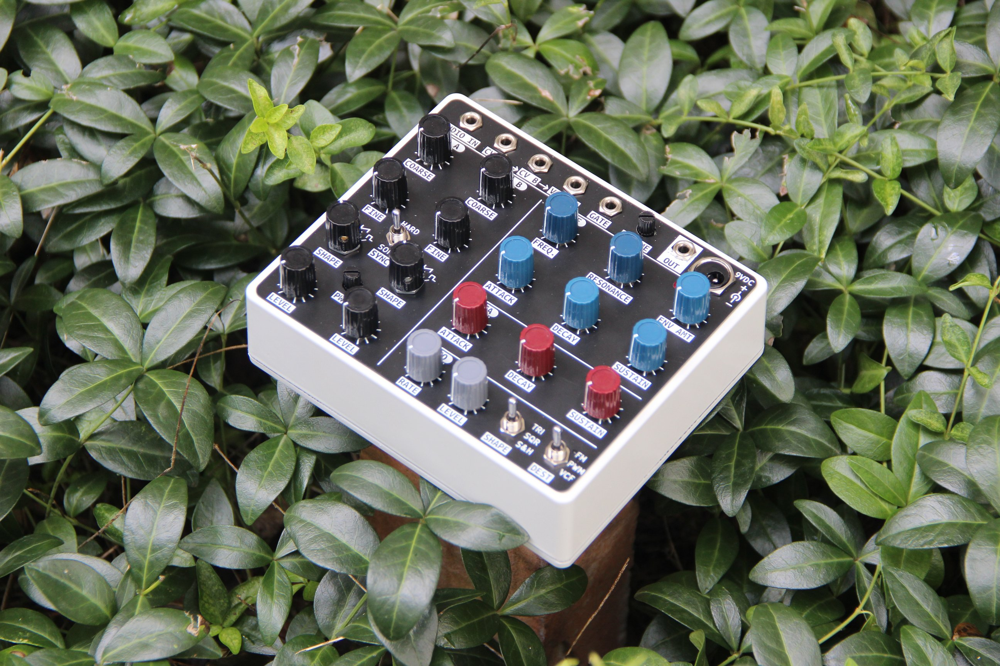

# Micro-Pico tiny monosynth

## A lil' analog synth with:
- Two SSI2130 VCOs
    - sine, triangle, sawtooth, and pulse waves available
    - VCO B can by syncronized to VCO A (hard and soft sync available)
    - the VCOs share a single manual pulse width control
- Two minimoog style ADS envelope generators
    - These envelopes cycle through all four A, D, S, and R stages, but the Decay and Release stages share a single potentiometer
- Modulation LFO
    - triangle, square, and sample & hold waveforms
    - can be routed to VCO FM, PWM, or VCF modulation
- Swappable VCF port
    - the VCF can be changed by plugging in a variety of [VCF plug-in boards](https://github.com/JordanAceto/VCF_plug_in_boards)
    - you need at least one of the above VCF boards to finish the synth
- Final linear VCA
    - simple linearized SSI2162 VCA
- Extra patch points on the pcb for mods and experimentation
    - independent aux FM inputs for the VCOs [-5v, +5v]
    - aux PWM CV [-5v, +5v]
    - aux VCF cutoff CV [-5v, +5v]
    - aux VCA amplitude CV [0v, +5v]
    - white noise out [-5v, +5v]

Powered with a standard guitar pedal style 9VDC center negative adapter.

The feature set is quite limited, emphasis is on small, simple, and all-analog signal path.

## Construction notes:
- It is easier to install the trimpots, VCF port headers, and various through-hole parts before installing the pots and switches
    - you can still get to everything if you forget, or need to change something later
- When installing the front panel components
    - dry fit all of the pots, switches, and jacks before soldering
    - the rotary switches need a nut or spacer under the panel to match the height of the pots
    - the 9VDC connector needs a nut or spacer under the panel, and needs to be lifted off the board a little, so that it protrudes far enough to tighten the outer nut
    - tighten down all of the components, check for alighment and height issues, and only then start soldering
- The rotary switches need a sleeve adapter for the knobs to fit nicely
    - something like [this](https://www.amplifiedparts.com/products/potentiometer-adapter-sleeve-converts-6mm-or-18t-shaft-14)
    - or use a bit of tubing if you're DIY happy
- It's designed to fit in a Hammond 1590XX aluminum box
    - these are available pre-painted in a few colors
    - with a VCF plug-in board installed, the 1590XX is the *teensiest* bit too short, the trimpots hit the lid when tightened
        - you can put some 2mm-ish washers between the lid and the box
        - eventually I hope to make a gasket that adds a few mm height and looks cleaner
    - other chassis at least as big as the 1590XX (plus a few mm taller) could work

## Status:

A complete synthesizer has been built with the current documents here.

This instrument works, but I'm still chasing some occasional VCO frequency locking issues. This is not a major problem, but it is present in the current docs.
