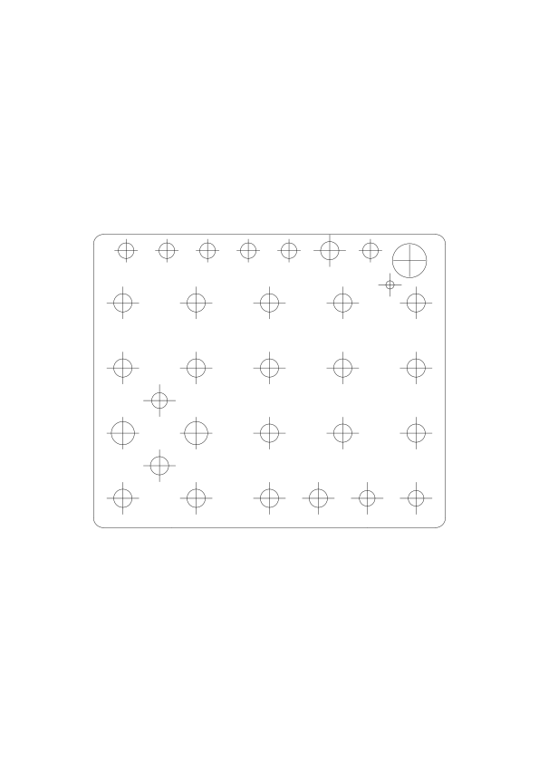

# Drill guide for the front panel holes

Print out 1-to-1 and double sticky tape to the front panel to locate the drill holes.

On my printer, I have the best luck getting the scaling right by printing the gerber file from KiCads gerber viewer.

