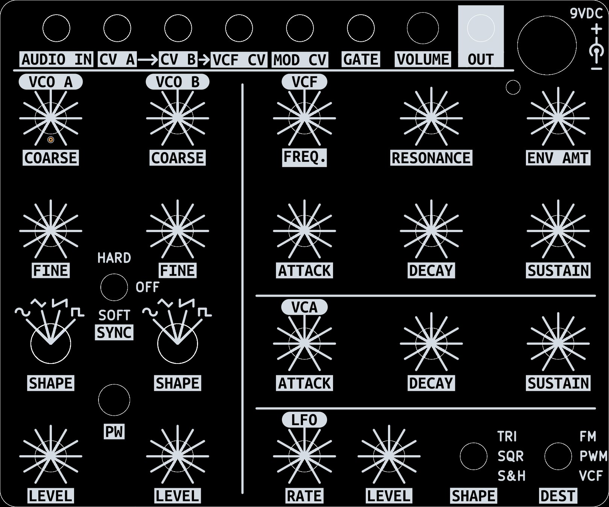

# Cheap and cheerful PCB front panel

KiCad 6 project and gerber files for making a front panel.

Open `index.html` in a web browser for easy documentation navigation.

## Important:
- The faceplate material should be 0.8mm or thinner. This ensures that the threaded panel components protrude far enough through the metal faceplate and pcb panel sandwich, so the nuts can be tightened.

