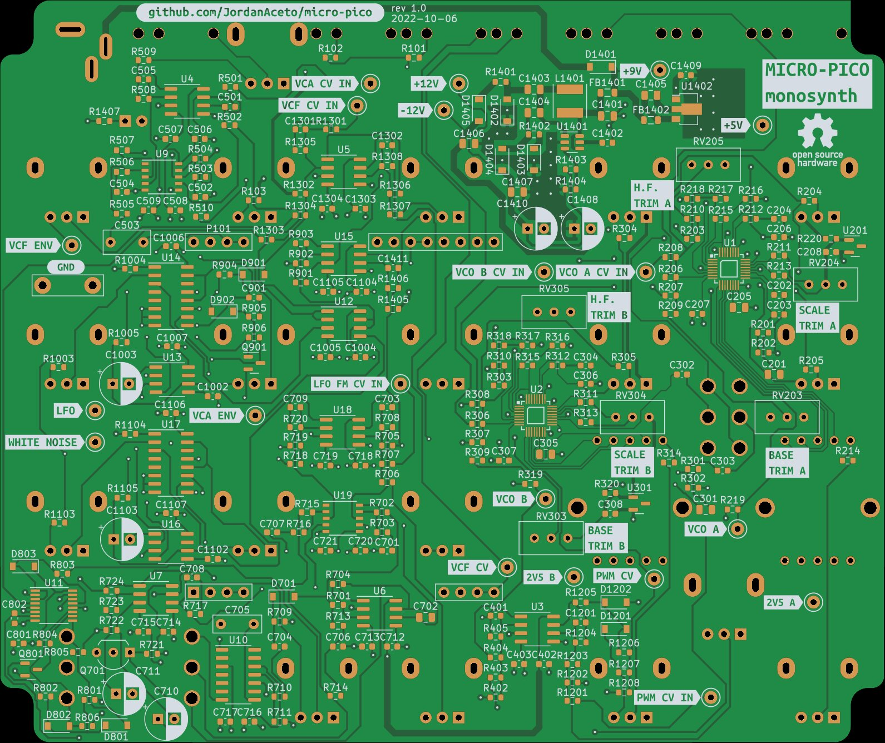

# Main PCB for tiny monosynth

## [SCHEMATIC](https://github.com/JordanAceto/micro-pico/blob/main/main_pcb/docs/micro_pico-schematic.pdf)

Open `index.html` in a web browser for easy documentation navigation.

